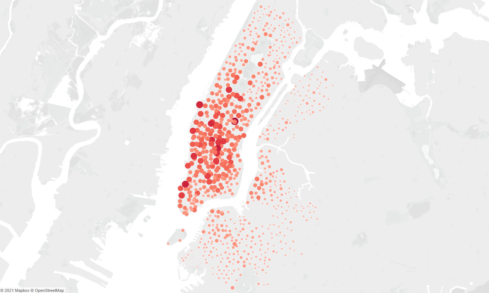
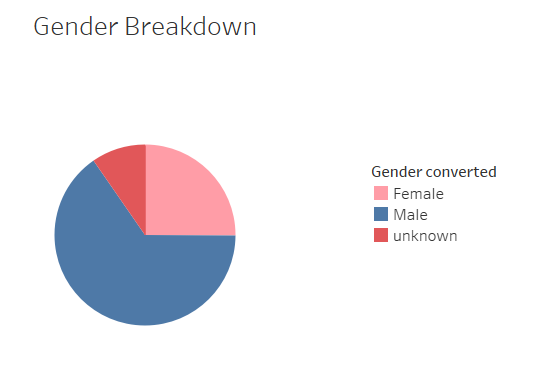
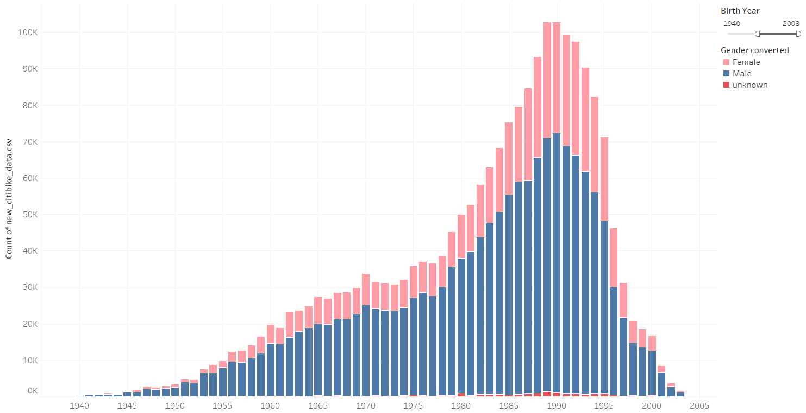
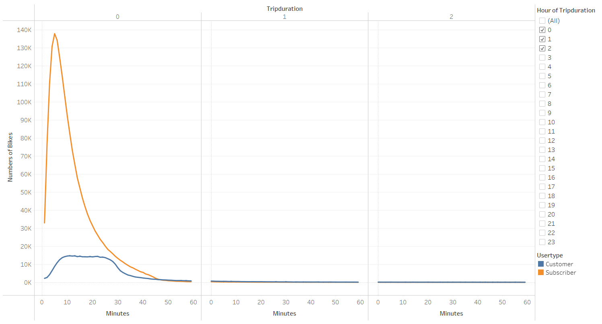
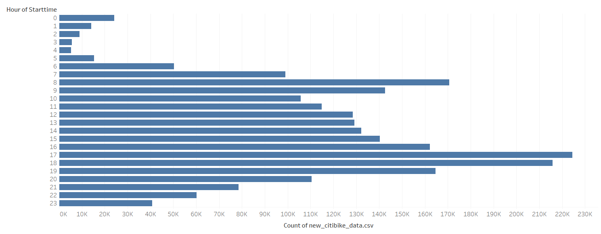
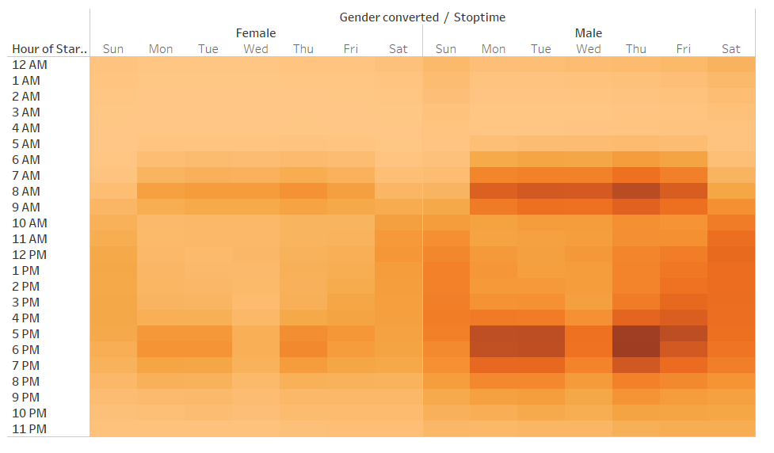
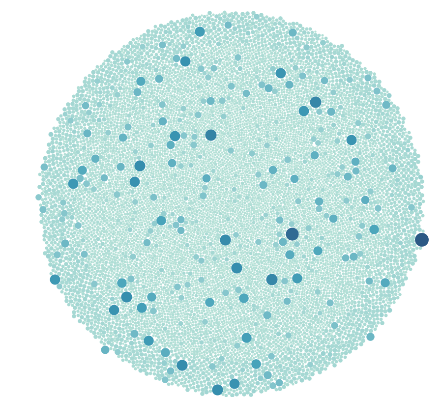
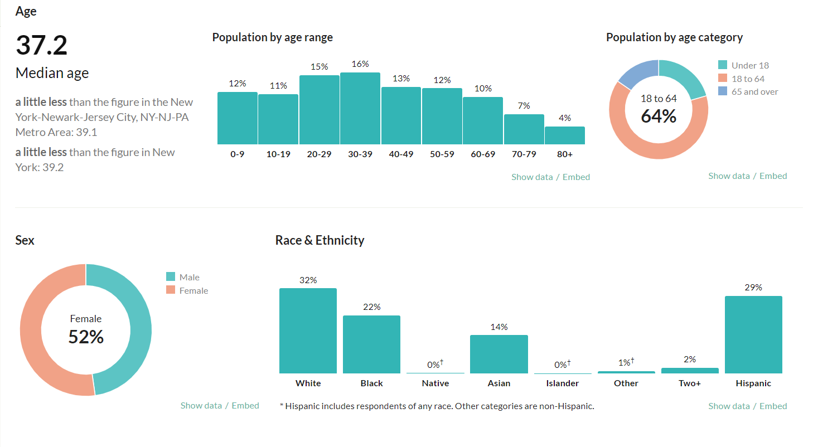
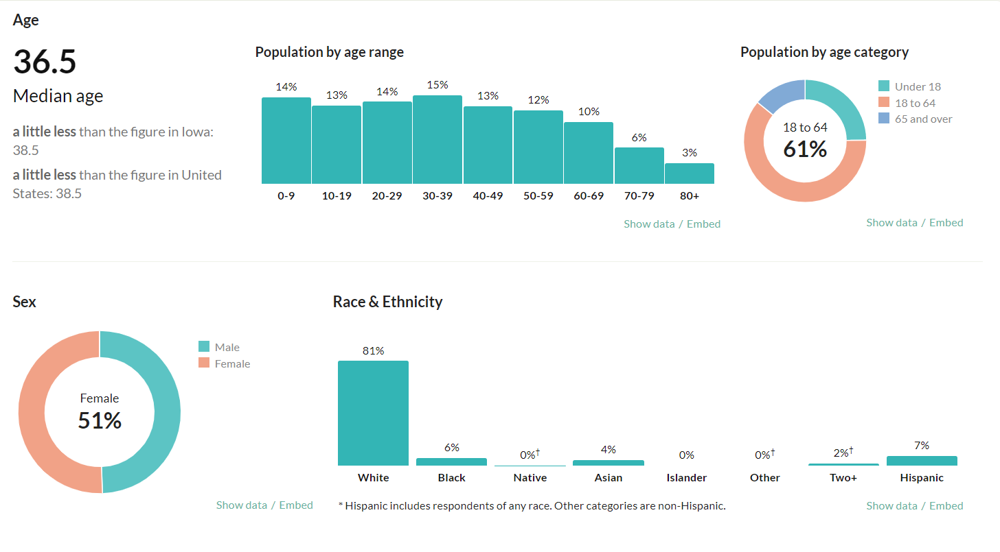

# Bike Sharing
Module 14

## Overview of the project:
The purpose of this project was to analyze New York City bike sharing data to learn more about the business model and apply it to Des Moines Iowa.

## Results:
•	For this analysis, we used `Tableau Public` to visualize multiple data sets from NYC Citi Bike sharing. First, we wanted to visualize on the map which bike station were the most popular, so we displayed longitudes and latitudes from bike stations on the map and used circle markers where the size is proportional to the trip count. We can see that central areas of Manhattan are the most popular, possibly due to high number of tourists and convenience for commuters.

•	Next, we were interested in gender usage, so we generated a pie chart for users by gender. We found that men represented roughly 65.3% of riders while women represented 25.1% and 9.6% were unknown.

•	In the following bar graph, we explored the trip count by age of riders and found most users were between 24 to 40 years old. These could be young professionals or students commuting to work or university.

•	Next, we looked at trip duration for customers versus subscribers and found that customers, possibly tourists, will ride longer but account for less than one fifth of the rides. Customers ride between 8 and 26 minutes while subscriber ride around 2 to 12 minutes. 

•	When we look at starting time for each ride, we can see that bike sharing is more popular between 7 am to 9 pm with spikes during morning and evening rush hour (8-10 am and 6-8 pm).

•	Similarly, looking at the hour by weekday by gender heatmap, we can see the same peak hour, especially for men. Surprisingly, Wednesday evening rush hour, and to a lesser extent Friday, were less busy than the other business days 5-7pm rush hour. This could be due to those days been more popular for workplace gathering such has pub night with people returning home later by train.

•	Our last analysis shows bike usage by id. We clearly see that some bicycles are used much more than others so we may need to rotate bike location or perform more maintenance on those specific bikes.

## Summary:
•	Based on our analysis, we found that men, especially those between the age of 24 and 40, represent the target population for bike sharing. Therefore, if we want to find out if bike sharing would be sustainable in Des Moines, we need to compare the population of both cities. When looking at the population by age, both cities have similar percentage of 20 to 39 years old. Both cities also have similar ratio of male to female. The major difference is in the population size where New York city has 8.4 million while Des Moines only has about 0.22 million and probably less tourists as well. The business model may be viable on a smaller scale, but we would need more data on average commuting distance and more details on traffic jam in Des Moines to see if bike sharing would be an attractive and sustainable alternative. A comparison of average monthly temperature and precipitation might be useful as well to compare the number of cyclable days with New York city. 
A detailed Tableau Public Story can be found here: https://public.tableau.com/app/profile/pascal.duchesneau/viz/BikeSharing2_16221564080020/BikeSharing

## New York City Demographics

## Des Moines City Demographics

